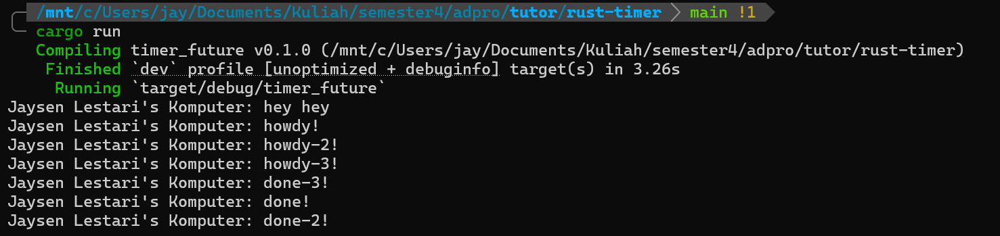
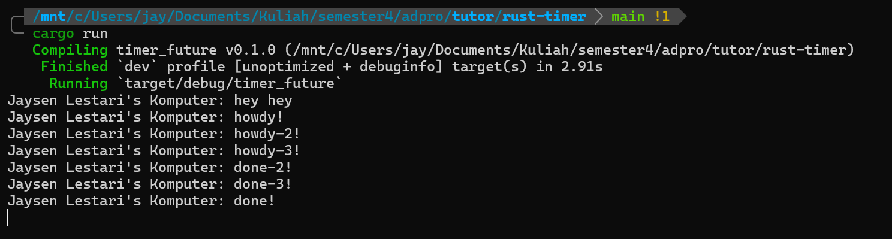

# Reflection

## Understanding How It Works


Pesan baru yaitu "Jaysen Lestari's Komputer: hey hey" muncul paling pertama dibandingkan dengan pesan lainnya karena berada langsung di fungsi `main()` yang dieksekusi secara sinkronus. Kemudian, pesan "Jaysen Lestari's Komputer: howdy!" muncul kedua karena berada dalam fungsi `async` yang dijalankan oleh _spawner_ sebagai task terpisah yang harus menunggu giliran dieksekusi oleh _executor_. Setelah pesan "howdy!" ditampilkan, eksekusi _task async_ dihentikan sementara oleh `TimerFuture::new(Duration::new(2, 0)).await` yang membuat _task_ berhenti selama 2 detik. Setelah masa tunggu tersebut selesai, task ini dilanjutkan kembali oleh _executor_ dan akhirnya mencetak "Jaysen Lestari's Komputer: done!". Urutan eksekusi ini menunjukkan bagaimana program Rust ini dapat menangani operasi asinkronus tanpa memblokir _thread_ utama yang kita miliki.

## Experiment 1.3: Multiple Spawn and Removing Drop

### Multiple Spawn


Pada percobaan ini, saya menambahkan beberapa task async menggunakan `spawner.spawn(...)`. Setelah semua task dimasukkan ke executor, program masih menggunakan `drop(spawner)`. Pesan hey hey muncul paling pertama karena berada langsung di dalam fungsi main(), sehingga dieksekusi secara sinkronus sebelum task async dijalankan oleh executor.

Setelah itu, pesan howdy!, howdy-2!, dan howdy-3! muncul karena task-task async yang dibuat menggunakan spawner.spawn(...) mulai dijalankan oleh executor. Setiap task kemudian berhenti sementara ketika mencapai bagian berikut:
```rust
TimerFuture::new(Duration::new(2, 0)).await;
```

Saat sebuah task sedang menunggu timer selesai, executor dapat menjalankan task lain yang juga sudah tersedia. Karena itu, beberapa pesan howdy dapat muncul terlebih dahulu sebelum pesan done.

Penggunaan drop(spawner) berfungsi untuk memberi tahu executor bahwa tidak akan ada task baru lagi yang dikirimkan. Dengan begitu, setelah semua task selesai dijalankan, executor dapat berhenti dan program berakhir secara normal.

### With Drop Spawner


Pada percobaan ini, saya menghapus drop(spawner) dari program. Tanpa drop(spawner), task-task async tetap dapat dijalankan sampai selesai. Hal ini terlihat dari semua pesan howdy dan done yang tetap berhasil muncul pada console.

Namun, setelah semua task selesai, program tidak berhenti secara otomatis. Hal ini terjadi karena spawner masih hidup. Selama spawner belum di-drop, executor menganggap bahwa masih ada kemungkinan task baru akan dikirimkan.

Akibatnya, executor terus menunggu task baru meskipun task-task sebelumnya sudah selesai. Inilah yang menyebabkan program tetap berjalan atau terlihat seperti menggantung setelah semua output dicetak.